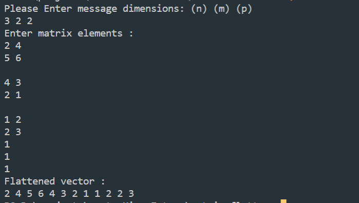

# matrix-flatten

this is a repo that flatten 3D matrix into a 1D vector

## installation

Clone the repo

```bash
git clone https://github.com/omarfareed/matrix-flatten.git
cd matrix-flatten
```

Run the Project using the following command

```bash
g++ ./matrix-flatten.cpp -o matrix-flatten
./matrix-flatten
```

## Features

1. Flat 3d matrix into 1D vector

## SnapShots


